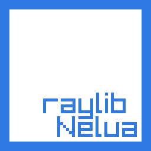

# raylib-nelua



This is a [Raylib][raylib-website] binding for [Nelua language][nelua-website].

## How to use

First, [install Nelua language][nelua-install] and [Raylib library][raylib-install].

Then, you can use `raylib.nelua`, you can use it as a project file or as a external library:

### As project file
Just move `raylib.nelua` file to your project.

### As external library
Clone or download this repository somewhere and then either:
* use the `-L` option, for example: `nelua -L ~/path/to/nelua-raylib my-game.nelua`
* use a `neluacfg.lua` script on the project's root directory or on your `$HOME/.config/nelua` with the content `return { add_path = {'/path/to/nelua-raylib'} }`
[(See about this here)][nelua-L-option]

## Quick Raylib-nelua specific changes:
This binding contains some extra features to better integrate with `nelua` language:

* unbounded arrays are specified on arguments and return types; for example, `Raylib.GetWaveData` returns a `*[0]float32` instead of just `*float32`
* for every record an `is_*` field is defined on the type information; for example, `## rAudioBuffer.value.is_raudiobuffer` is `true`;
* several functions are also applied to records, for example, `function Camera.UpdateCamera(camera: *Camera)` is defined, which can be used as a method `camera:UpdateCamera()`;
* operator overloading functions for `raymath.h`functions defined:
    * `Vector2`: 
        * `__add`: calls `Vector2Add`
        * `__sub`: calls `Vector2Subtract`
        * `__len`: calls `Vector2Length`
        * `__unm`: calls `Vector2Negate`
        * `__div`: calls `Vector2Divide` or `Vector2DivideV`
        * `__mul`: calls `Vector2Scale` or `Vector2MultiplyV`
    * `Vector3`: 
        * `__add`: calls `Vector3Add`
        * `__sub`: calls `Vector3Subtract`
        * `__len`: calls `Vector3Length`
        * `__unm`: calls `Vector3Negate`
        * `__mul`: calls `Vector3Scale` or `Vector3Multiply`
        * `__div`: calls `Vector3Divide` or `Vector3DivideV`
    * `Matrix`: 
        * `__add`: calls `MatrixAdd`
        * `__sub`: calls `MatrixSubtract`
        * `__mul`: calls `MatrixMultiply`
    * `Quaternion`: 
        * `__len`: calls `QuaternionLength`
        * `__mul`: calls `QuaternionMultiply`

**NOTE: TraceLogCallback and SetTraceLogCallback aren't imported**

## Example

```Lua
require 'raylib'

-- [[ Initialization [[
local screen_width: integer <comptime> = 800
local screen_height: integer <comptime> = 450
Raylib.InitWindow(screen_width, screen_height, "raylib-nelua [core] example - keyboard input")

local ball_position: Vector2 = { screen_width / 2, screen_height / 2}

Raylib.SetTargetFPS(60) -- Set our game to run at 60 frames-per-second
-- ]] Initialization ]]

-- [[ Main game loop [[
while not Raylib.WindowShouldClose() do -- Detect window close button or ESC key
  -- [[ Update [[
  if Raylib.IsKeyDown(KeyboardKey.KEY_RIGHT) then
    ball_position.x = ball_position.x + 2
  end
  if Raylib.IsKeyDown(KeyboardKey.KEY_LEFT) then
    ball_position.x = ball_position.x - 2
  end
  if Raylib.IsKeyDown(KeyboardKey.KEY_UP) then
    ball_position.y = ball_position.y - 2
  end
  if Raylib.IsKeyDown(KeyboardKey.KEY_DOWN) then
    ball_position.y = ball_position.y + 2
  end
   -- ]] Update ]]

   -- [[ Draw [[
  Raylib.BeginDrawing()
    Raylib.ClearBackground(RAYWHITE)
    Raylib.DrawText("move the ball with arrow keys", 10, 10, 20, DARKGRAY)
    Raylib.DrawCircleV(ball_position, 50, MAROON)
  Raylib.EndDrawing()
  -- ]] Draw ]]
end

-- [[ De-Initialization [[
Raylib.CloseWindow() -- Close window and OpenGL context
-- ]] De-Initialization ]]
```

[raylib-website]: https://www.raylib.com/
[raylib-install]: https://github.com/raysan5/raylib#build-and-installation
[nelua-website]: https://nelua.io/
[nelua-install]: https://nelua.io/installing/
[nelua-L-option]: https://github.com/edubart/nelua-lang/commit/9683c40d2d99e119990ea19666be0f22fa7f9303
